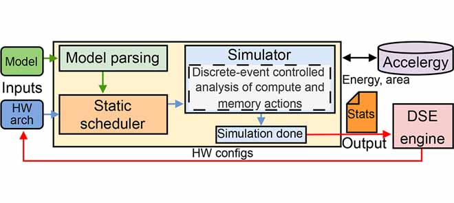

# TransInferSim - fast analysis of Transformer Network inference
TransInferSim is a cycle-accurate simulator for analyzing the hardware performance of Transformer NN inference on custom systolic-array accelerators. Combined with Accelergy, it reports latency, energy, area, and other efficiency metrics, enabling cache-policy analysis, memory-hierarchy optimization, hardware design-space exploration, and exportable execution plans for RTL validation and deployment. 



## Features
- Analyzes Transformer NN inference on hardware
- Integrates with Accelergy for energy estimation
- Includes various plugins for Accelergy's flexibility

### Reference
If you find our work useful, please refer [our paper](https://ieeexplore.ieee.org/document/11202474).

    J. Klhufek, A. Marchisio, V. Mrazek, L. Sekanina and M. Shafique, "TransInferSim: Toward Fast and Accurate Evaluation of Embedded Hardware Accelerators for Transformer Networks," in IEEE Access, vol. 13, pp. 177215-177226, 2025, doi: 10.1109/ACCESS.2025.3621062.

```bibtex
@ARTICLE{transinfersim,
  author={Klhufek, Jan and Marchisio, Alberto and Mrazek, Vojtech and Sekanina, Lukas and Shafique, Muhammad},
  journal={IEEE Access}, 
  title={TransInferSim: Toward Fast and Accurate Evaluation of Embedded Hardware Accelerators for Transformer Networks}, 
  year={2025},
  volume={13},
  number={},
  pages={177215-177226},
  keywords={Transformers;Accuracy;Hardware acceleration;Computational modeling;Schedules;Analytical models;Data models;Computer architecture;Memory management;Register transfer level;Transformers;hardware accelerators;modeling tools;memory subsystem;evaluation and optimizations},
  doi={10.1109/ACCESS.2025.3621062}}
```

## Installation
To get started with TransInferSim, follow these steps:

### Prerequisites
- Python 3.8 or higher

This project requires Graphviz to be installed on your system.
On Ubuntu/Debian, you can install it using:

```sh
sudo apt-get install graphviz
```

### Clone and build the Repository
Clone the repository and its submodules and build using pip:

```sh
git clone --recurse-submodules https://github.com/ehw-fit/TransInferSim
cd TransInferSim
python3 -m venv venv
source venv/bin/activate
pip install --upgrade pip wheel setuptools
./scripts/setup_submodules.sh
pip install .
```

### Usage
You can find an example run in the `example.py` script, which demonstrates how to instantiate a transformer model or layer of your choice along with a showcase of an example hardware specification. The script then runs an inference simulation, and the runtime performance statistics are saved to a `stats_out.txt` file.

### Licence
This project is licensed under the MIT License - see the LICENSE file for details.
